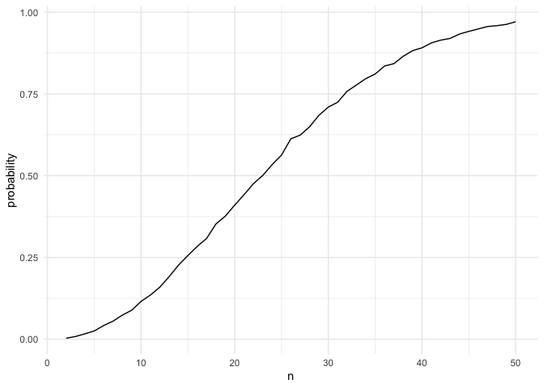
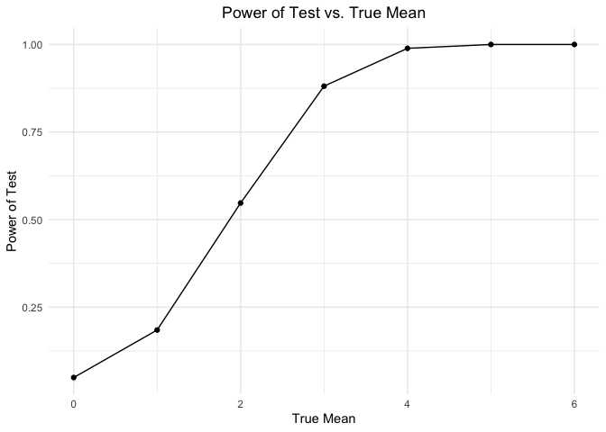
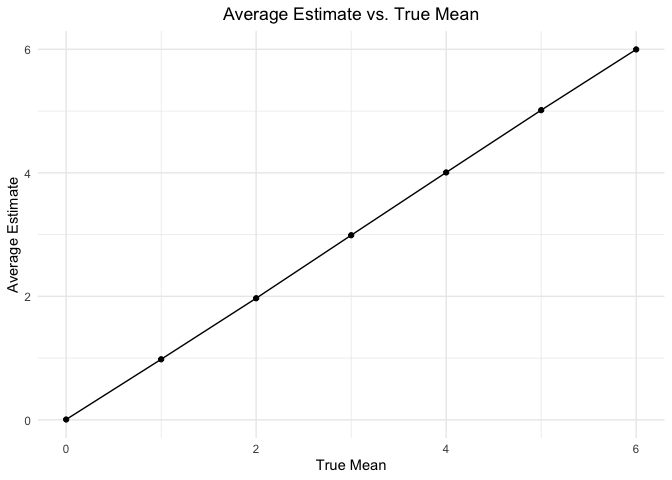
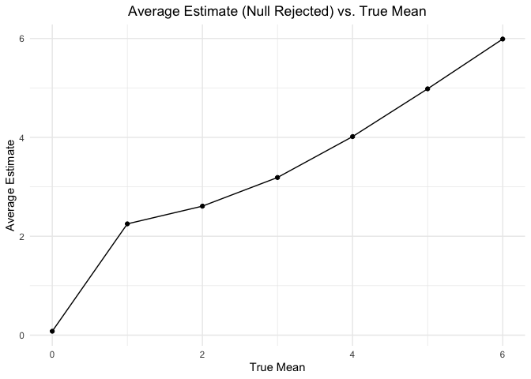

P8105 Homework 5
================
Hyun Kim (hk3373)
2024-11-10

# Problem 1

## Function to randomly draw birthday, check duplicates and return true or false

``` r
sim_birthday = function(n) {

  birthdays = sample(1:365, size = n, replace = TRUE)
  duplicate = length(unique(birthdays)) < n
  
  return(duplicate)
  
}
```

## Run function 10000 times for each group size between 2 and 50

``` r
sim_birthday_results = 
  expand_grid(n = 2:50,
              iter = 1:10000) |> 
  mutate(birthday_result = map_lgl(n, sim_birthday)) |> 
  group_by(n) |> 
  summarize(probability = mean(birthday_result))
```

## Plot the probability as a function of group size

``` r
sim_birthday_results |> 
  ggplot(aes(x = n, y = probability)) + 
  geom_line()
```

<!-- -->

Group size and the probability that at least two people in group will
share a birthday shows a positive relationship. As the group size
increases, the probability also increases, approaching the value of 1.

# Problem 2

## Function to perform one sample t-test

``` r
sim_t_test = function(mu, n = 30, sigma = 5) {
  
  sim_data = rnorm(n, mean = mu, sd = sigma)
  
  t_test_result = 
    t.test(sim_data, 
           conf.levl = 1 - 0.05) |>
    broom::tidy() |>
    select(estimate, p.value)
  
  return(t_test_result)
}
```

## Generate 5000 datasets

``` r
mu_zero_result =
  expand_grid(
    mu = 0,
    iter = 1:5000) |>
  mutate(test_result = map(mu, sim_t_test)) |>
  unnest(test_result)
```

## Repeat the above for true mean = {1, 2, 3, 4, 5, 6}

``` r
sim_test_results = 
  expand_grid(
    mu = 1:6,
    iter = 1:5000) |>
  mutate(test_result = map(mu, sim_t_test)) |>
  unnest(test_result) |>
  bind_rows(mu_zero_result)
```

## Plot proportion of times the null was rejected vs. true mean

``` r
sim_test_results |>
  group_by(mu) |>
  summarize(reject_prop = sum(p.value < 0.05) / n()) |>
  ggplot(aes(y = reject_prop, x = mu)) +
  geom_point() +
  geom_line() +
  labs(x = "True Mean",
       y = "Power of Test",
       title = "Power of Test vs. True Mean")
```

<!-- -->

As the true mean increases, the power of the test increases, approaching
the value of 1. Therefore, there is a positive association between true
mean and power.

## Plot average estimate vs. true mean

``` r
sim_test_results |>
  group_by(mu) |>
  summarize(avg_estimate = mean(estimate)) |>
  ggplot(aes(y = avg_estimate, x = mu)) +
  geom_point() +
  geom_line() +
  labs(x = "True Mean",
       y = "Average Estimate",
       title = "Average Estimate vs. True Mean") 
```

<!-- -->

## Plot average estimate (null rejected) vs. true mean

``` r
sim_test_results |>
  filter(p.value < 0.05) |>
  group_by(mu) |>
  summarize(avg_estimate = mean(estimate)) |>
  ggplot(aes(y = avg_estimate, x = mu)) +
  geom_point() +
  geom_line() +
  labs(x = "True Mean",
       y = "Average Estimate",
       title = "Average Estimate (Null Rejected) vs. True Mean")
```

<!-- -->

The sample average of the estimate across tests for which the null is
rejected is approximately equal to the true mean, since the data points
and plot line reflect an estimated value that is close to the true mean.
