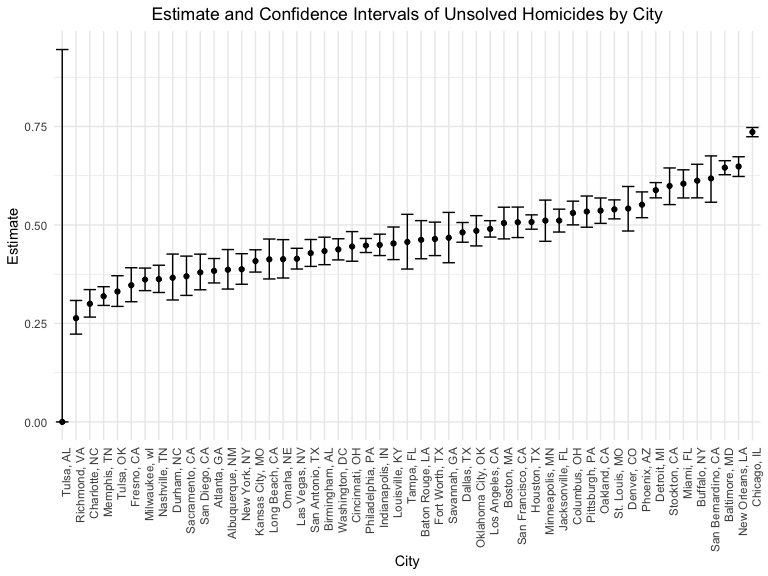

P8105 Homework 5
================
Hyun Kim (hk3373)
2024-11-10

# Problem 1

## Function to randomly draw birthday, check duplicates and return true or false

``` r
sim_birthday = function(n) {

  birthdays = sample(1:365, size = n, replace = TRUE)
  duplicate = length(unique(birthdays)) < n
  
  return(duplicate)
  
}
```

## Run function 10000 times for each group size between 2 and 50

``` r
sim_birthday_results = 
  expand_grid(n = 2:50,
              iter = 1:10000) |> 
  mutate(birthday_result = map_lgl(n, sim_birthday)) |> 
  group_by(n) |> 
  summarize(probability = mean(birthday_result))
```

## Plot the probability as a function of group size

``` r
sim_birthday_results |> 
  ggplot(aes(x = n, y = probability)) + 
  geom_line()
```

<!-- -->

Group size and the probability that at least two people in group will
share a birthday shows a positive relationship. As the group size
increases, the probability also increases, approaching the value of 1.

# Problem 2

## Function to perform one sample t-test

``` r
sim_t_test = function(mu, n = 30, sigma = 5) {
  
  sim_data = rnorm(n, mean = mu, sd = sigma)
  
  t_test_result = 
    t.test(sim_data, 
           conf.levl = 1 - 0.05) |>
    broom::tidy() |>
    select(estimate, p.value)
  
  return(t_test_result)
}
```

## Generate 5000 datasets

``` r
mu_zero_result =
  expand_grid(
    mu = 0,
    iter = 1:5000) |>
  mutate(test_result = map(mu, sim_t_test)) |>
  unnest(test_result)
```

## Repeat the above for true mean = {1, 2, 3, 4, 5, 6}

``` r
sim_test_results = 
  expand_grid(
    mu = 1:6,
    iter = 1:5000) |>
  mutate(test_result = map(mu, sim_t_test)) |>
  unnest(test_result) |>
  bind_rows(mu_zero_result)
```

## Plot proportion of times the null was rejected vs. true mean

``` r
sim_test_results |>
  group_by(mu) |>
  summarize(reject_prop = sum(p.value < 0.05) / n()) |>
  ggplot(aes(y = reject_prop, x = mu)) +
  geom_point() +
  geom_line() +
  labs(x = "True Mean",
       y = "Power of Test",
       title = "Power of Test vs. True Mean")
```

<!-- -->

As the true mean increases, the power of the test increases, approaching
the value of 1. Therefore, there is a positive association between true
mean and power.

## Plot average estimate vs. true mean

``` r
sim_test_results |>
  group_by(mu) |>
  summarize(avg_estimate = mean(estimate)) |>
  ggplot(aes(y = avg_estimate, x = mu)) +
  geom_point() +
  geom_line() +
  labs(x = "True Mean",
       y = "Average Estimate",
       title = "Average Estimate vs. True Mean") 
```

<!-- -->

## Plot average estimate (null rejected) vs. true mean

``` r
sim_test_results |>
  filter(p.value < 0.05) |>
  group_by(mu) |>
  summarize(avg_estimate = mean(estimate)) |>
  ggplot(aes(y = avg_estimate, x = mu)) +
  geom_point() +
  geom_line() +
  labs(x = "True Mean",
       y = "Average Estimate",
       title = "Average Estimate (Null Rejected) vs. True Mean")
```

<!-- -->

The sample average of the estimate across tests for which the null is
rejected is approximately equal to the true mean, since the data points
and plot line reflect an estimated value that is close to the true mean.

# Problem 3

## Describe the raw data

``` r
homicide_df = 
  read_csv("data/homicide-data.csv") |>
  janitor::clean_names()
```

    ## Rows: 52179 Columns: 12
    ## ── Column specification ────────────────────────────────────────────────────────
    ## Delimiter: ","
    ## chr (9): uid, victim_last, victim_first, victim_race, victim_age, victim_sex...
    ## dbl (3): reported_date, lat, lon
    ## 
    ## ℹ Use `spec()` to retrieve the full column specification for this data.
    ## ℹ Specify the column types or set `show_col_types = FALSE` to quiet this message.

``` r
str(homicide_df)
```

    ## spc_tbl_ [52,179 × 12] (S3: spec_tbl_df/tbl_df/tbl/data.frame)
    ##  $ uid          : chr [1:52179] "Alb-000001" "Alb-000002" "Alb-000003" "Alb-000004" ...
    ##  $ reported_date: num [1:52179] 20100504 20100216 20100601 20100101 20100102 ...
    ##  $ victim_last  : chr [1:52179] "GARCIA" "MONTOYA" "SATTERFIELD" "MENDIOLA" ...
    ##  $ victim_first : chr [1:52179] "JUAN" "CAMERON" "VIVIANA" "CARLOS" ...
    ##  $ victim_race  : chr [1:52179] "Hispanic" "Hispanic" "White" "Hispanic" ...
    ##  $ victim_age   : chr [1:52179] "78" "17" "15" "32" ...
    ##  $ victim_sex   : chr [1:52179] "Male" "Male" "Female" "Male" ...
    ##  $ city         : chr [1:52179] "Albuquerque" "Albuquerque" "Albuquerque" "Albuquerque" ...
    ##  $ state        : chr [1:52179] "NM" "NM" "NM" "NM" ...
    ##  $ lat          : num [1:52179] 35.1 35.1 35.1 35.1 35.1 ...
    ##  $ lon          : num [1:52179] -107 -107 -107 -107 -107 ...
    ##  $ disposition  : chr [1:52179] "Closed without arrest" "Closed by arrest" "Closed without arrest" "Closed by arrest" ...
    ##  - attr(*, "spec")=
    ##   .. cols(
    ##   ..   uid = col_character(),
    ##   ..   reported_date = col_double(),
    ##   ..   victim_last = col_character(),
    ##   ..   victim_first = col_character(),
    ##   ..   victim_race = col_character(),
    ##   ..   victim_age = col_character(),
    ##   ..   victim_sex = col_character(),
    ##   ..   city = col_character(),
    ##   ..   state = col_character(),
    ##   ..   lat = col_double(),
    ##   ..   lon = col_double(),
    ##   ..   disposition = col_character()
    ##   .. )
    ##  - attr(*, "problems")=<externalptr>

The dataset has 52179 rows and 12 columns including uid, the victim’s
first name, last name, race, age, sex, city, state and disposition as
character variables, and reported date, latitude and longitude as
numeric variables.

## Create city_state variable

``` r
homicide_df = 
  homicide_df |>
  mutate(city_state = str_c(city, state, sep = ", "))
```

## Summarize within cities to obtain total number of homicides and unsolved homicides

``` r
homicide_prop_df = 
  homicide_df |>
  group_by(city_state) |>
  summarize(
    total_homicides = n(),
    unsolved_homicides = 
      sum(disposition %in% c("Closed without arrest", "Open/No arrest"))) 
```

## Estimate the proportion of unsolved homicides for Baltimore, MD

``` r
baltimore_homicide = 
  homicide_prop_df |>
  filter(city_state == "Baltimore, MD") 

baltimore_result_df =
  prop.test(x = pull(baltimore_homicide, unsolved_homicides),
            n = pull(baltimore_homicide, total_homicides)) |>
  broom::tidy()
```

## Pull the estimated proportion and confidence intervals of Baltimore

``` r
pull(baltimore_result_df, estimate)
```

    ##         p 
    ## 0.6455607

``` r
pull(baltimore_result_df, conf.high)
```

    ## [1] 0.6631599

``` r
pull(baltimore_result_df, conf.low)
```

    ## [1] 0.6275625

## Define function and run prop.test for each city in the dataset

``` r
homicide_prop_test = function(city) {
  
  homicide_city_df = 
      homicide_prop_df |>
      filter(city_state == city) 
  
  prop_test_result = 
    prop.test(x = pull(homicide_city_df, unsolved_homicides),
              n = pull(homicide_city_df, total_homicides)) |>
    broom::tidy() |>
    select(estimate, conf.low, conf.high)
  
  return(prop_test_result)
}

city_prop_results = 
  expand_grid(city = pull(homicide_prop_df, city_state)) |>
  mutate(prop_result = map(city, homicide_prop_test)) |>
  unnest(prop_result)
```

    ## Warning: There was 1 warning in `mutate()`.
    ## ℹ In argument: `prop_result = map(city, homicide_prop_test)`.
    ## Caused by warning in `prop.test()`:
    ## ! Chi-squared approximation may be incorrect

``` r
city_prop_results
```

    ## # A tibble: 51 × 4
    ##    city            estimate conf.low conf.high
    ##    <chr>              <dbl>    <dbl>     <dbl>
    ##  1 Albuquerque, NM    0.386    0.337     0.438
    ##  2 Atlanta, GA        0.383    0.353     0.415
    ##  3 Baltimore, MD      0.646    0.628     0.663
    ##  4 Baton Rouge, LA    0.462    0.414     0.511
    ##  5 Birmingham, AL     0.434    0.399     0.469
    ##  6 Boston, MA         0.505    0.465     0.545
    ##  7 Buffalo, NY        0.612    0.569     0.654
    ##  8 Charlotte, NC      0.300    0.266     0.336
    ##  9 Chicago, IL        0.736    0.724     0.747
    ## 10 Cincinnati, OH     0.445    0.408     0.483
    ## # ℹ 41 more rows

## Plot estimates and CIs for each city

``` r
city_prop_results |>
  ggplot(aes(y = estimate, x = reorder(city, estimate))) + 
  geom_point() +
  geom_errorbar(aes(ymin = conf.low, ymax = conf.high)) + 
  theme(axis.text.x = element_text(angle = 90, hjust = 1)) +
  labs(y = "Estimate",
       x = "City", 
       title = "Estimate and Confidence Intervals of Unsolved Homicides by City")
```

<!-- -->
